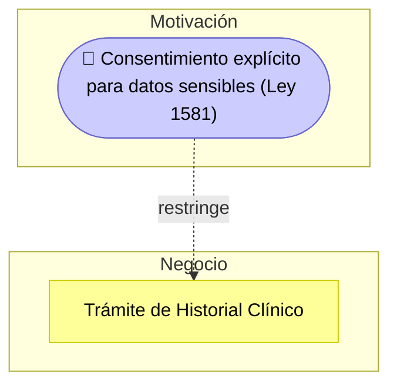

# 🧭 Guía Paso a Paso: Checklist de Cumplimiento Normativo

Esta guía complementa el `README.md` del taller. Su objetivo es que, antes de evaluar el cumplimiento normativo de GobData en clase (Parte 1) o del sistema del cliente real (Parte 2), el equipo tenga una referencia clara de qué exige cada marco y de la metodología para pasar de "marcar casillas" a un diagnóstico legal priorizado.

---

## 1. Marcos normativos de referencia

| Marco / Norma | Qué exige (resumen) | Aplica cuando... |
|---|---|---|
| Habeas Data (Ley 1581 de 2012 - Colombia) | Consentimiento informado, finalidad del tratamiento, derechos ARCO (Acceso, Rectificación, Cancelación, Oposición) | El sistema recolecta datos personales de ciudadanos o usuarios colombianos |
| ISO/IEC 27001 | Gestión sistemática de la seguridad de la información: control de accesos, gestión de incidentes, continuidad | El sistema maneja información que debe protegerse de forma sistemática |
| Protección contra fugas de datos | Cifrado, monitoreo y respuesta ante incidentes de exposición de datos | El sistema almacena o transmite datos sensibles |
| Consentimiento, auditoría y roles de acceso | Registro de quién accede a qué dato, bajo qué autorización | El sistema tiene múltiples roles con distinto nivel de acceso a datos sensibles |

---

## 2. Metodología en 5 pasos

1. **Identificar datos y procesos sensibles** — liste qué información procesa el sistema y qué normativa le aplica a cada una.
2. **Construir el checklist** — agrupe los requisitos a verificar por categoría (consentimiento, seguridad, protección de datos, prevención de fugas, retención), basándose en los marcos de la sección 1.
3. **Evaluar el cumplimiento** — para cada ítem, marque **Cumple**, **Parcial**, **Brecha** o **No aplica**, siempre con evidencia o justificación concreta.
4. **Documentar el riesgo de cada brecha** — explique qué pasa si esa brecha no se corrige (sanción, exposición de datos, pérdida de trazabilidad).
5. **Priorizar y recomendar** — ordene las brechas por riesgo y proponga una acción correctiva concreta para cada una.

---

## 3. Ejemplo guiado: Checklist de GobData

### Paso 1 — Identificar datos y procesos sensibles

| Dato / Proceso | Sensibilidad | Normativa aplicable |
|---|---|---|
| Número de identificación (cédula) | Dato personal | Ley 1581 |
| Historial clínico | Dato sensible (salud) | Ley 1581 (tratamiento reforzado) |
| Dirección de residencia | Dato personal | Ley 1581 |
| Certificados digitales | Dato de identidad / autenticación | ISO 27001 (control de accesos) |
| Trámites y peticiones ciudadanas | Trazabilidad de gestión pública | ISO 27001 (auditoría) |

### Paso 2 — Construir el checklist por categoría

| Categoría | Ítem |
|---|---|
| Consentimiento | C1: Existe aviso de privacidad accesible antes de recolectar datos |
| Consentimiento | C2: Se solicita consentimiento explícito para datos sensibles (ej. historial clínico) |
| Seguridad (ISO 27001) | S1: Los datos sensibles están cifrados en tránsito y en reposo |
| Seguridad (ISO 27001) | A1: El acceso a datos sensibles está limitado por rol (RBAC) |
| Protección de Datos | A2: Existe registro de auditoría de quién accede a qué dato y cuándo |
| Prevención de Fugas | S2: Existe un procedimiento documentado de respuesta a incidentes de fuga de datos |
| Retención | R1: Existe una política de tiempo de retención y eliminación de datos |
| Retención | R2: Los datos se eliminan o anonimizan al vencer su finalidad |

### Paso 3 — Evaluar el cumplimiento

Cada ítem se marca con el nivel de cumplimiento oficial de la plantilla — no son solo dos estados (Cumple / Brecha): existe un tercer estado intermedio, **⚠️ Parcial**, para cuando un control está implementado de forma incompleta y no encaja bien en un Cumple/Brecha estricto (por ejemplo, un control aplicado solo a una parte del sistema):

| N° | Categoría | Criterio de Cumplimiento | Nivel de Cumplimiento | Evidencia / Justificación | Recomendación |
|---|---|---|---|---|---|
| 1 | Consentimiento | Existe aviso de privacidad accesible antes de recolectar datos | ✅ Cumple | El portal publica un aviso de privacidad visible antes del registro | Mantenerlo visible y revisarlo ante cambios normativos |
| 2 | Consentimiento | Se solicita consentimiento explícito para datos sensibles (ej. historial clínico) | ⚠️ Brecha | El formulario de trámites de salud no pide consentimiento separado para el historial clínico | Agregar un consentimiento explícito y separado para historial clínico |
| 3 | Seguridad (ISO 27001) | Los datos sensibles están cifrados en tránsito y en reposo | ⚠️ Parcial | El cifrado en reposo está implementado, pero los certificados digitales se transmiten sin verificar TLS en todos los subdominios | Forzar TLS en todos los subdominios y auditar certificados |
| 4 | Seguridad (ISO 27001) | El acceso a datos sensibles está limitado por rol (RBAC) | ✅ Cumple | El sistema define roles (ciudadano, funcionario, administrador) | Revisar la asignación de roles periódicamente |
| 5 | Protección de Datos | Existe registro de auditoría de quién accede a qué dato y cuándo | ⚠️ Brecha | No hay registro visible de auditoría de accesos a historiales clínicos | Implementar registro de auditoría (logs) de acceso a datos sensibles |
| 6 | Prevención de Fugas | Existe un procedimiento documentado de respuesta a incidentes de fuga de datos | ⚠️ Brecha | No existe un procedimiento documentado de respuesta a incidentes | Documentar procedimiento de respuesta a incidentes de fuga de datos |
| 7 | Retención | Existe una política de tiempo de retención y eliminación de datos | ⚠️ Brecha | No hay una política de retención publicada | Definir y publicar política de retención y eliminación |
| 8 | Retención | Los datos se eliminan o anonimizan al vencer su finalidad | ⚠️ Brecha | Consecuencia directa del ítem 7: sin política, no hay eliminación programada | Automatizar la eliminación/anonimización una vez definida la política |

### Paso 4 — Documentar el riesgo de cada brecha

| N° | Categoría | Riesgo si no se corrige |
|---|---|---|
| 2 | Consentimiento | Sanción de la SIC por tratamiento de datos sensibles sin consentimiento explícito (Ley 1581) |
| 3 | Seguridad (ISO 27001) | Exposición de certificados digitales y posible suplantación de identidad ciudadana mientras el cifrado en tránsito no cubra todos los subdominios |
| 5 | Protección de Datos | Imposibilidad de demostrar cumplimiento ante una auditoría o investigación de la SIC |
| 6 | Prevención de Fugas | Respuesta lenta y desordenada ante una fuga real, agravando el impacto |
| 7 / 8 | Retención | Acumulación indefinida de datos sensibles, incumpliendo el principio de finalidad de la Ley 1581 |

### Paso 5 — Priorizar y recomendar

Esta es la tabla final que se entrega como `checklist-cliente.xlsx`, con la misma estructura de la hoja **Brechas Identificadas** de la plantilla oficial, ordenada de mayor a menor prioridad:

| Categoría | Brecha | Riesgo | Recomendación Prioritaria | Nivel de Prioridad |
|---|---|---|---|---|
| Consentimiento | No se solicita consentimiento explícito y separado para datos sensibles (historial clínico) | Sanción legal por tratamiento de dato sensible sin consentimiento (Ley 1581) | Agregar un consentimiento explícito y separado para historial clínico | Alta |
| Seguridad (ISO 27001) | El cifrado en tránsito no se verifica ni se fuerza en todos los subdominios (TLS parcial) | Exposición de certificados digitales y posible suplantación de identidad ciudadana | Forzar TLS en todos los subdominios y auditar certificados | Alta |
| Protección de Datos | No hay registro visible de auditoría de accesos a historiales clínicos | Sin trazabilidad ante auditoría | Implementar registro de auditoría (logs) de acceso a datos sensibles | Alta |
| Retención | No existe política de retención ni eliminación/anonimización programada de datos | Retención indefinida de datos, incumpliendo el principio de finalidad de la Ley 1581 | Definir y publicar política de retención y eliminación | Media |
| Prevención de Fugas | No existe un procedimiento documentado de respuesta a incidentes de fuga de datos | Respuesta desordenada ante incidentes | Documentar procedimiento de respuesta a incidentes de fuga de datos | Media |

Vea esta misma tabla en su [versión visual e interactiva](visualizacion-normatividad.html), con la evidencia y el riesgo de cada ítem del checklist un clic más cerca.

---

## 4. Errores comunes a evitar

| Error frecuente | Por qué es un problema | Cómo corregirlo |
|---|---|---|
| Marcar "Cumple" sin evidencia concreta | El checklist se vuelve una opinión, no una auditoría verificable | Cite dónde se observa el cumplimiento (documento, pantalla, configuración) |
| Usar "No aplica" para evitar analizar un ítem incómodo | Oculta brechas reales en vez de documentarlas | Solo use "No aplica" cuando el sistema genuinamente no procesa ese tipo de dato/proceso |
| Copiar el checklist genérico sin adaptarlo al sector del cliente | Ignora normativas sectoriales específicas (salud, educación, finanzas) | Investigue y agregue normativas propias del sector del cliente (MinSalud, MinTIC, SuperSalud, SFC, etc.) |
| Recomendaciones sin relación con la brecha encontrada | El informe pierde utilidad práctica para el cliente | Cada recomendación debe corregir directamente el ítem marcado como brecha |

---

## 5. Checklist de autoevaluación antes de entregar

- [ ] Cada ítem está evaluado como Cumple, Parcial, Brecha o No aplica, con evidencia o justificación.
- [ ] Los ítems están organizados por categoría (consentimiento, seguridad, protección de datos, prevención de fugas, retención, etc.).
- [ ] Cada brecha tiene un riesgo legal/operativo explicado, no solo "no cumple".
- [ ] Se investigaron normativas sectoriales adicionales aplicables al cliente.
- [ ] Las brechas están priorizadas y cada una tiene una recomendación correctiva concreta.
- [ ] El informe cita la normativa específica detrás de cada hallazgo, cuando aplica.

---

## 6. Vista ArchiMate equivalente

Igual que en el Taller 5, cada brecha del checklist se modela como un elemento de Motivación (ver la [Guía de Notación ArchiMate](https://github.com/CesarAVegaF312/AREM-ArchiMate/blob/main/guia_notacion_archimate.md)) — pero aquí normalmente es una **Constraint** (algo que la ley obliga, no una opción de diseño) en vez de un Requirement funcional.

La tabla de priorización (Paso 5) es, otra vez, el insumo directo: cada ítem marcado como "Brecha" se convierte en una `Constraint` que restringe al proceso de negocio o al componente de aplicación donde ocurre — y que después, en el Taller 7, origina un `Gap` a cerrar en el TO-BE.

---

_Esta guía hace parte del Taller 6 de Checklist de Cumplimiento Normativo — curso Arquitectura Empresarial, Universidad de La Sabana._
